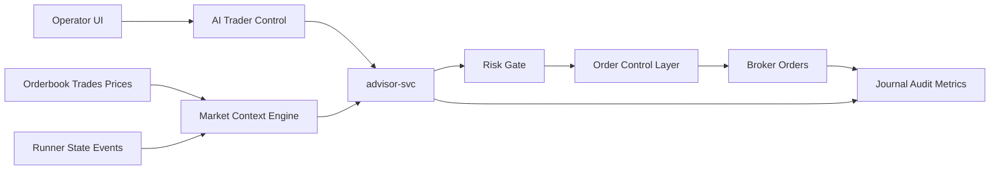

# AI Trader / Scalper Architecture

Canonical project knowledge lives in Obsidian:
`24alert/AI Trader Scalper.md`.

This document is the repo-facing technical design for adding a live AI trader
that can be enabled from the dashboard for a selected futures instrument.

## Goal

Add a separate `advisor-svc` / `ai-trader` service. The operator selects a
futures ticker in the UI, provides a short trading instruction, and starts a
session in one of three modes:

- `observe`: watch market microstructure and write decisions, no virtual fills;
- `paper`: trade virtually using order book / prints;
- `armed_live`: place real orders through deterministic risk gates and order
  control.

The target live trader watches order books, public prints, last price, strategy
state, broker position, technical context, and adjacent instruments. It can
scale in/out, manage limit orders, flatten, and explain every action.

## Non-goals

- Do not put this inside Dashboard AI Chat. The chat remains read-only.
- Do not put this inside the cron AI Scanner. The scanner remains research and
  auto-config automation.
- Do not allow direct broker API access from the AI agent.
- Do not let an LLM bypass deterministic risk gates.

## Target Architecture



## Current Platform Gaps

Market data:

- `internal/gateway/handlers/stream.go` exposes:
  - `GET /api/v1/stream/candles`
  - `GET /api/v1/stream/orderbook`
  - `GET /api/v1/stream/trades`
  - `GET /api/v1/stream/last-price`
- `internal/marketdata/stream.go` has internal `SubscribeTrades` and
  `SubscribeLastPrice`; gateway now exposes them as read-only WebSocket APIs.
- `StreamManager` now uses shared fan-out/ref-count subscriptions, so multiple
  downstream consumers can read the same `(uid, stream type, depth)` without
  opening duplicate upstream T-Invest subscriptions.
- Order book stream currently limits `uids` to 50 in code and sends snapshots
  only.
- Slow consumers can cause silent snapshot drops.
- Reconnect re-subscribes upstream and keeps downstream fan-out hubs alive.

Orders:

- `internal/order/service.go` supports `PostOrder`, `CancelOrder`,
  `ReplaceOrder`, `GetOrders`, `GetOrderState`, and stop orders.
- Current strategy model returns `strategy.Signal`, which is not enough for
  cancel/replace/target-position workflows.
- Partial fills and replace chains need stronger persistent accounting.
- Risk checks need to include broker position + active orders + proposed action.

## Market Microstructure Foundation

Add or formalize these streams:

| Stream | Endpoint | Source | Purpose |
|--------|----------|--------|---------|
| Order book | `/api/v1/stream/orderbook` | existing orderbook stream | depth, spread, imbalance |
| Public trades | `/api/v1/stream/trades` | `SubscribeTrades` | prints, direction, quantity |
| Last price | `/api/v1/stream/last-price` | `SubscribeLastPrice` | price heartbeat |
| Unified market | `/api/v1/stream/market` | not implemented | future one-feed endpoint for `advisor-svc` |

All market events should use a common envelope:

```json
{
  "type": "orderbook",
  "uid": "instrument-uid",
  "seq": 123456,
  "exchange_ts": "2026-05-18T10:01:02.123Z",
  "receive_ts": "2026-05-18T10:01:02.156Z",
  "data_freshness_ms": 33,
  "dropped_before": 0,
  "payload": {}
}
```

Required derived features:

- best bid / best ask / mid;
- absolute and bps spread;
- top-N bid/ask volume;
- imbalance and depth skew;
- wall persistence and wall pull/add rate;
- print delta and volatility bursts;
- stale-data and dropped-frame counters.

## Order Control Layer

The AI trader should emit actions, not bare buy/sell signals.

| Action | Purpose |
|--------|---------|
| `place_market` | immediate entry/exit |
| `place_limit` | passive order with TTL |
| `cancel` | cancel one active order |
| `replace` | amend price/qty with a new client order id |
| `cancel_all` | cancel all orders owned by the session |
| `flatten` | close the current position |
| `reduce_only` | reduce exposure only |
| `target_position` | move broker position toward target qty |

Persist order ownership with:

- `session_id`, `account_id`, `instrument_uid`;
- client order id and broker order id;
- parent order id for replacement chains;
- side, type, requested qty, price;
- cumulative filled qty, remaining qty, avg fill price;
- status, timestamps, risk decision id, reason.

Partial fills must be handled as delta fills. `partially_filled` must not clear
the order lifecycle as if the whole order filled.

## Risk Gates

`RiskGate` is deterministic and blocks any action that violates policy.

Required gates:

- session explicitly enabled in UI;
- selected instrument only, futures only;
- FORTS session guard and trading status pass;
- fresh orderbook / prints / broker state;
- max position;
- max order size;
- max active orders;
- max trades per minute;
- max cancel/replace rate;
- max session loss and max daily loss;
- spread/slippage guard;
- futures margin / GO check;
- broker position and active-order reconciliation.

Emergency behavior:

- stale market data: cancel entry orders, block new entries;
- lost order stream: block actions and reconcile;
- loss limit: cancel all and flatten or safe-stop according to session policy;
- runaway cancel/replace: freeze session;
- broker/session mismatch: cancel all and require operator review.

## advisor-svc API

Draft API:

| Method | Path | Purpose |
|--------|------|---------|
| `POST` | `/ai-trader/sessions` | create/start session |
| `GET` | `/ai-trader/sessions` | list sessions |
| `GET` | `/ai-trader/sessions/{id}` | status, position, active orders |
| `POST` | `/ai-trader/sessions/{id}/pause` | pause without flatten |
| `POST` | `/ai-trader/sessions/{id}/stop` | stop and cancel active orders |
| `POST` | `/ai-trader/sessions/{id}/flatten` | flatten position |
| `POST` | `/ai-trader/sessions/{id}/instruction` | update operator instruction |
| `GET` | `/ai-trader/sessions/{id}/events` | decisions/actions/rejections |
| `GET` | `/ai-trader/sessions/{id}/features` | current microstructure features |

Example session config:

```yaml
mode: armed_live
account_id: "2001673385"
instrument_uid: "..."
ticker: BMM6
instruction: "ищи роботов и плотности, скальпинг частями"
limits:
  max_position: 1
  max_order_size: 1
  max_active_orders: 2
  max_trades_per_minute: 3
  max_cancel_replace_per_minute: 10
  max_session_loss_rub: 300
  max_daily_loss_rub: 500
  max_spread_bps: 15
  stale_data_ms: 1500
  session_timeout_minutes: 30
```

## Trader Brain

Use a hybrid model:

- deterministic feature engine computes facts and hard gates;
- LLM/agent evaluates context, writes hypotheses, and chooses tactical intent;
- deterministic risk and order layers decide whether anything is executable.

Initial tactics:

- passive entry near a persistent wall;
- breakout through liquidity;
- fade false/spoof walls;
- scale-in ladder;
- partial take-profit;
- reduce on adverse prints;
- flatten on orderbook risk;
- trailing based on microstructure.

## UI Panel

Add an `AI Trader` panel to the strategy dashboard:

- futures ticker/UID selector;
- account selector;
- mode selector;
- instruction textarea;
- limits form;
- start/pause/stop;
- kill switch;
- flatten;
- cancel all active orders;
- orderbook ladder;
- prints tape;
- spread/mid/imbalance;
- broker/session position;
- active orders;
- risk state;
- last decision;
- rejected actions journal.

## Observability

Metrics:

- `alert24_ai_trader_sessions_active`
- `alert24_ai_trader_feed_freshness_ms`
- `alert24_ai_trader_events_total`
- `alert24_ai_trader_dropped_events_total`
- `alert24_ai_trader_decisions_total`
- `alert24_ai_trader_decision_latency_seconds`
- `alert24_ai_trader_llm_latency_seconds`
- `alert24_ai_trader_llm_errors_total`
- `alert24_ai_trader_risk_rejections_total`
- `alert24_ai_trader_orders_total`
- `alert24_ai_trader_cancel_replace_total`
- `alert24_ai_trader_partial_fills_total`
- `alert24_ai_trader_slippage_rub`
- `alert24_ai_trader_pnl_rub`
- `alert24_ai_trader_kill_switch_total`

Persist every decision with:

- session id;
- operator instruction;
- model and prompt version;
- feature snapshot hash;
- tactical intent and confidence;
- chosen action;
- risk result;
- order ids;
- broker execution outcome;
- resulting position and PnL.

## Minimal Delivery Sequence

1. Add the docs and safety spec.
2. Add trades/last-price/unified gateway streams.
3. Add explicit drop counters/freshness metrics to existing orderbook/trade/last-price hubs.
4. Add persistent order-control schema and action model.
5. Add `advisor-svc` in `observe` and `paper`.
6. Add dashboard AI Trader panel without live execution.
7. Add metrics, audit journal, and session reports.
8. Enable `armed_live` only for one selected futures instrument with small
   limits, short timeout, and visible kill switch.

## Implemented Slice: observe/paper foundation

Status: implemented in `strategy-runner` as a safe foundation, not yet as a
separate `advisor-svc`.

Runtime API:

- `GET /ai-trader/sessions`
- `POST /ai-trader/sessions`
- `GET /ai-trader/sessions/{instance_id}`
- `POST /ai-trader/sessions/{instance_id}/stop`

Safety properties:

- supported modes are only `observe` and `paper`;
- `armed_live` is rejected server-side;
- a session is created from `account_id + instrument_uid + operator prompt`;
- `instance_id` is only a backward-compatible fallback for prefilling
  account/instrument and must not be treated as ownership by a standard
  strategy;
- no `PostOrder`, `CancelOrder`, `ReplaceOrder`, or stop-order call is reachable
  from the AI Trader code path;
- one running AI Trader session per account/instrument;
- session timeout and conservative default limits are applied;
- decisions are appended to JSONL audit at `AI_TRADER_JOURNAL_PATH`, default
  `data/ai_trader_journal.jsonl`.

Current market source:

- polls `marketdata.Service.GetOrderbook` every `observation_interval_ms`
  (default 2000 ms);
- computes best bid/ask, mid, spread, top-5 bid/ask volume, imbalance, depth
  skew, largest bid/ask wall, freshness/stale flag, and top-of-book snapshot.

Dashboard:

- new `AI Trader` tab in Strategy Dashboard;
- operator can start `observe` or `paper` for the selected futures strategy;
- UI shows microstructure features, last decision, and decision journal;
- live orders are explicitly labelled as disabled.

Next steps before live:

1. Move audit from JSONL to queryable SQLite session/event tables.
2. Add trades and last-price consumption.
3. Add paper position/fill simulator.
4. Add Prometheus metrics for sessions, feed freshness, decisions, and blocked
   reasons.
5. Implement deterministic OrderControl and live RiskGate before enabling
   `armed_live`.
