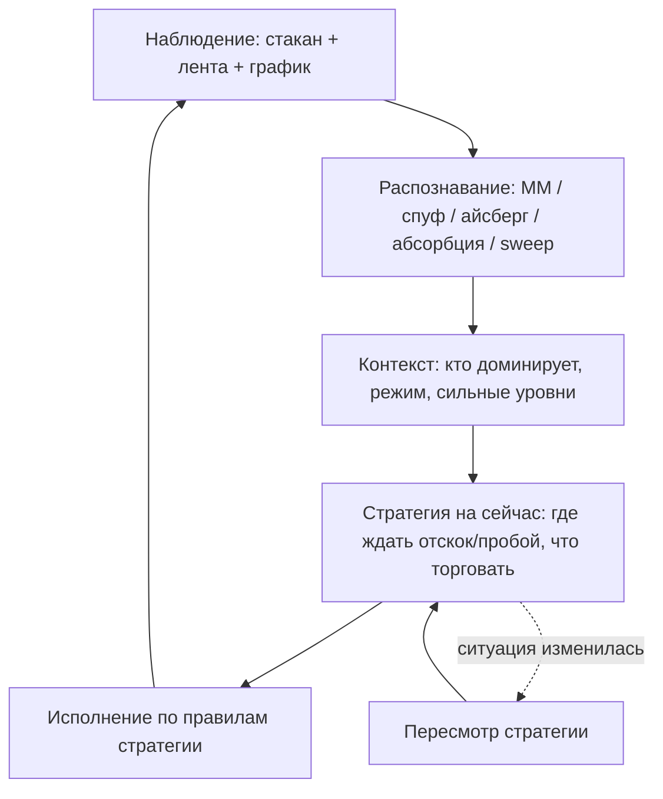

# AI Trader: целевая модель (канон)

## Цикл (как задумано оператором)

1. **Наблюдение** — непрерывный сбор стакана, принтов, 1m/5m/15m, advisor.
2. **Распознавание** — детерминированные детекторы + LLM сводит в гипотезу об участниках.
3. **Уровни** — daily/hourly/POC в зоне цены; стены стакана = контекст, не цель входа (BMM6: график и коррелятор важнее).
4. **Стратегия** — явный документ сессии: гипотеза, ключевые уровни, тактика (bounce/break/wait), allow long/short.
5. **Торговля** — только после `session_strategy.active`; исполнение по `active_policy`, не «комментарий в UI».
6. **Пересмотр** — в `trading` сбор продолжается; стратегия обновляется по таймеру/смене режима, не каждые 2 с.

## Что было не так (legacy)

| Проблема | Следствие |
|----------|-----------|
| Торговля **до** LLM-тика | Ордера по stale signal |
| LLM = `summary` + JSON | Иллюзия анализа без обязательной стратегии |
| Rule-engine imbalance → bias | «Тупые» входы без контекста |
| bid/ask wall как уровень | Входы у коррелятора, не у S/R |
| Нет `session_strategy` | Кнопка Start trading без плана |

## Реализация в коде (Phase 2+)

- `session_strategy` на сессии, `strategy_ready` в `phase_progress`.
- `observeAITraderOnce`: сначала brain/LLM, потом `tickLive`/`tickPaper`.
- Входы: `sessionStrategyAllowsEntry` + micro gates (spoof → block).
- `AI_TRADER_AUTO_PLAYBOOK_ENTRY=false` по умолчанию — только сигнал по стратегии.
- LLM в `analyzing`/`ready` обязан заполнить `session_strategy` в JSON.

См. `internal/strategy/ai_trader_session_strategy.go`, `ai_trader_strategy_brain.go`.
